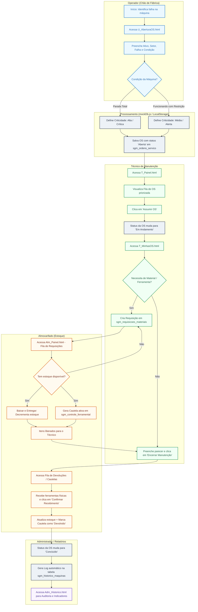

```mermaid
flowchart TD
    %% Configuração de Estilos e Cores para os Perfis
    classDef operator fill:#EBF8FF,stroke:#3182CE,stroke-width:2px,color:#2B6CB0;
    classDef tech fill:#F0FFF4,stroke:#38A169,stroke-width:2px,color:#276749;
    classDef warehouse fill:#FFFAF0,stroke:#DD6B20,stroke-width:2px,color:#7B341E;
    classDef system fill:#EDF2F7,stroke:#4A5568,stroke-width:2px,color:#2D3748;
    classDef admin fill:#FAF5FF,stroke:#805AD5,stroke-width:2px,color:#553C9A;

    subgraph OPERATOR ["Operador (Chão de Fábrica)"]
        A[Início: Identifica falha na máquina]
        B[Acessa U_AberturaOS.html]
        C[Preenche Ativo, Setor, Falha e Condição]
        D{Condição da Máquina?}
    end

    subgraph SYSTEM ["Processamento (mockDb.js / LocalStorage)"]
        E1[Define Criticidade: Alta / Crítica]
        E2[Define Criticidade: Média / Alerta]
        F[Salva OS com status 'Aberta' em sgm_ordens_servico]
    end

    subgraph TECH ["Técnico de Manutenção"]
        G[Acessa T_Painel.html]
        H[Visualiza Fila de OS priorizada]
        I[Clica em 'Assumir OS']
        J[Status da OS muda para 'Em Andamento']
        K[Acessa T_MinhasOS.html]
        L{Necessita de Material / Ferramenta?}
        M[Cria Requisição em sgm_requisicoes_materiais]
        N[Preenche parecer e clica em 'Encerrar Manutenção']
    end

    subgraph WAREHOUSE ["Almoxarifado (Estoque)"]
        O[Acessa Alm_Painel.html - Fila de Requisições]
        P{Tem estoque disponível?}
        Q1[Baixar e Entregar: Decrementa estoque]
        Q2[Gera Cautela ativa em sgm_controle_ferramental]
        R[Itens liberados para o Técnico]
        S[Acessa Fila de Devoluções / Cautelas]
        T[Recebe ferramentas físicas e clica em 'Confirmar Recebimento']
        U[Atualiza estoque + Marca Cautela como 'Devolvido']
    end

    subgraph ADMIN ["Administrador / Relatórios"]
        V[Status da OS muda para 'Concluído']
        W[Gera Log automático na tabela sgm_historico_maquinas]
        X[Acessa Adm_Historico.html para Auditoria e Indicadores]
    end

    %% Conexões do Fluxo
    A --> B --> C --> D
    D -- Parada Total --> E1
    D -- Funcionando com Restrição --> E2
    E1 & E2 --> F
    F --> G --> H --> I
    I --> J --> K
    K --> L
    L -- Sim --> M
    M --> O
    O --> P
    P -- Sim --> Q1 & Q2
    P -- Não --> M
    Q1 & Q2 --> R --> N
    L -- Não --> N
    N --> S
    S --> T --> U --> V
    V --> W --> X

    %% Aplicação de Estilos
    class A,B,C,D operator;
    class E1,E2,F,J,V,W system;
    class G,H,I,K,L,M,N tech;
    class O,P,Q1,Q2,R,S,T,U warehouse;
    class X admin;
```

